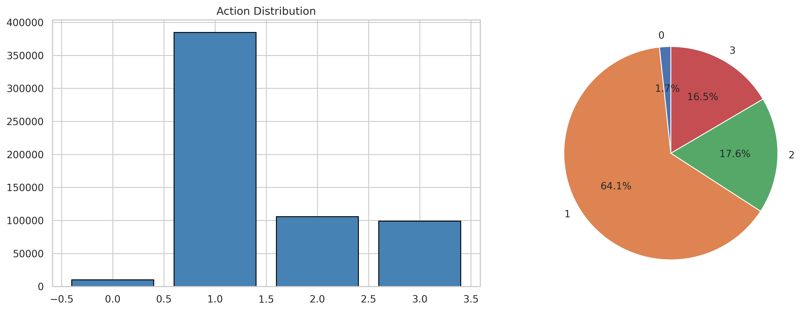
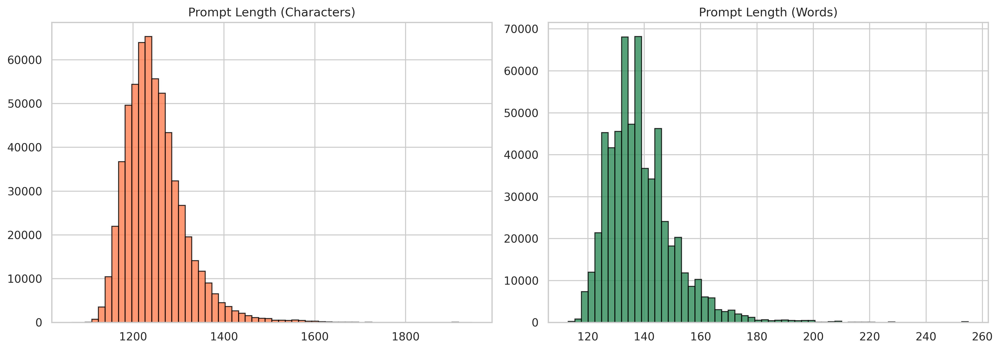
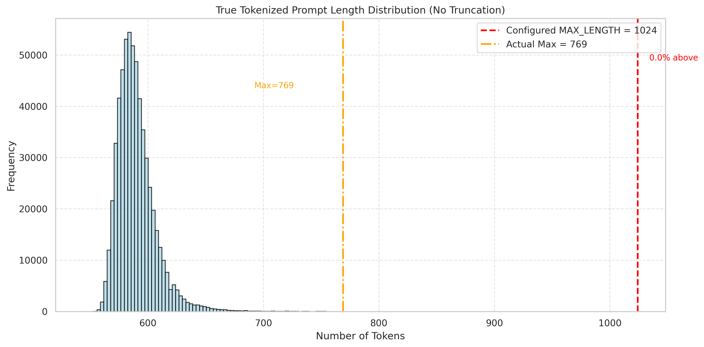

## Language to Action Model (L2AM) Training Guide

### 0.1 Setup the python envirenment

```bash
conda create -n l2am python=3.10
cd l2am_ws
pip install -r requirements.txt
```
### 0.2 Prepare the R2R data

Download the `l2am_r2r` data and put it under `./data`. The result data directory should be like this:

```bash
./data/
└── l2am_r2r # the data
```


### 1.1 Start traning run locally (debug)
```bash
cd l2am_ws
bash ./scripts/debug_launch_train.sh
```

### 1.2 Submitting training using slurm run on servers

Remember to change the `PYTHON` executable directory in the `.sh` scripts to your local python executable directory.

```bash
cd l2am_ws
bash ./scripts/slurm_launch_train.sh
```

### 2. Analyze the features of R2R language dataset

This is important for balancing the training weights for each actions as well as deciding the proper max-length of the input ids for the model.

Execute the notebook: [scripts/features_analysis.ipynb](scripts/features_analysis.ipynb)

Results are similar to the follows:







An example of the formulated prompt is shown in [resources/longest_example.txt](resources/longest_example.txt)

Note: If you sccessfully run the notebook, the above results can be found at `outputs/l2a_longformer_action_classifier`.

### 3. Inference

Refer to [inference.ipynb](inference.ipynb) for the usage of the model.

The trained model checkpoints are saved at `outputs/`. Moddels under `outputs/` will be updated while training. So copies of the stable trained model from `outputs/` are saved to `data/` for inference example. 

It is advised to use `ActionChunkPredictor` api class for action chunk inference as described in Section 4 of [inference.ipynb](inference.ipynb).